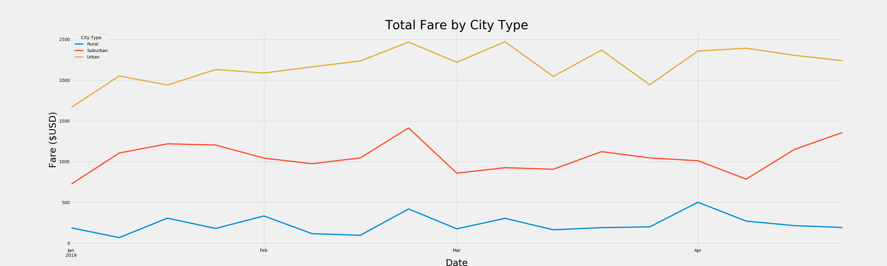

# PyBer Analysis Report

## Background and Results
### Purpose: 
- In this module, data analysis was performed for python based ride-sharing company, PyBer. 

### Technical Analysis
- Several visualization method was using to performed the analysis, which are line graph, bar chart, scatter plot, etc. Also, analysis was done by writing python script using Jupyter notebook, Pandas libraries, and Matplotlib.

### Results
- According to the PyBer summaries based on city type, urban cities has highest number of total rides and lower average fare per ride. In urban cities, ride-sharing is more economically benefit the riders. However, average fare per driver shows us that it is beneficary for drivers to work in rural cities.

- Analysis for total fare by city type was performed to have a deeper study. Based on the graph below, in all three types of cities, there's peak towards the end of Febuary. However, the graph shows relatively stable trend, and we can concluded that ride-sharing market has a group of stable users in each type of cities.

### Summary

## Challenges Encountered and Overcome
- In this challenge, big portion of data sets were involved with different name of variable. When performed the analysis, variables tend to be confusing sometimes, which this issue might causing wrong analysis was done or wrong data was generated or used. In order to prevent the mistakes, variable names have to be set in a more understandable and resonable way. By doing so, accurate information will be generated as well as easy maintenance of other analyst. 

## Recommendations and Next Steps
- Based on the data from different city types, urban cities have higher demand on ride-sharing, but the average ride fare is a lot lower comparing to suburban and rural cities. In the other hand, rural cities tend to have less people taking the ride-sharing and it doesn't seems to be economically benefit the riders. To promote the ride-sharing in rural cities and to reduce fare in rural cities might be a good action to the in rural or suburban cities. Discounts or promotions can be used to stimulate the ride-sharing market. 

